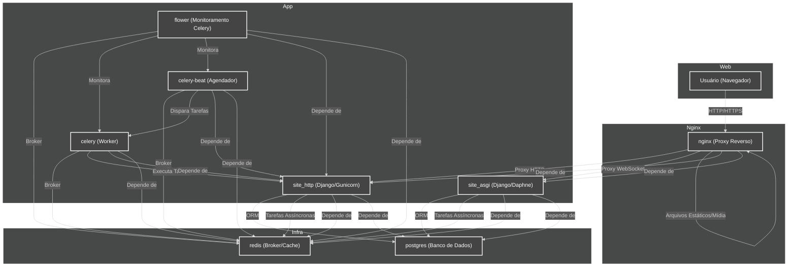

# Diagrama de Arquitetura

> **Última atualização:** 21/02/2026

Este diagrama representa a arquitetura do projeto PDL, do acesso do usuário ao banco de dados, incluindo todos os serviços orquestrados pelo Docker Compose.

## Legenda dos Componentes
- **Usuário (Navegador):** Cliente acessando o sistema.
- **nginx:** Proxy reverso, serve arquivos estáticos e encaminha requisições para Django.
- **site_http:** Aplicação Django via Gunicorn (requisições HTTP síncronas).
- **site_asgi:** Aplicação Django via Daphne (WebSockets e requisições assíncronas).
- **celery:** Worker de tarefas assíncronas.
- **celery-beat:** Agendador de tarefas periódicas.
- **flower:** Dashboard de monitoramento do Celery.
- **redis:** Broker de mensagens e cache.
- **postgres:** Banco de dados PostgreSQL.

---

[ Voltar ao Índice](../INDEX.md)

