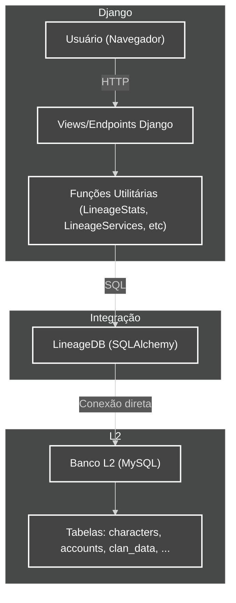

# Diagrama de Integração: Django x Banco L2

> **Última atualização:** 21/02/2026

Este diagrama ilustra como o app `apps.lineage.server` conecta o Django ao banco de dados do Lineage 2 (L2), detalhando o fluxo de dados e as responsabilidades de cada camada.

## Legenda
- **Usuário (Navegador):** Cliente acessando o site.
- **Views/Endpoints Django:** Camada de apresentação e API.
- **Funções Utilitárias:** Camada de lógica que prepara e executa as consultas.
- **LineageDB:** Classe de integração que conecta o Django ao banco L2 via SQLAlchemy.
- **Banco L2:** Banco de dados do servidor do jogo, com tabelas específicas do Lineage 2.

---

[ Voltar ao Índice](../INDEX.md)

