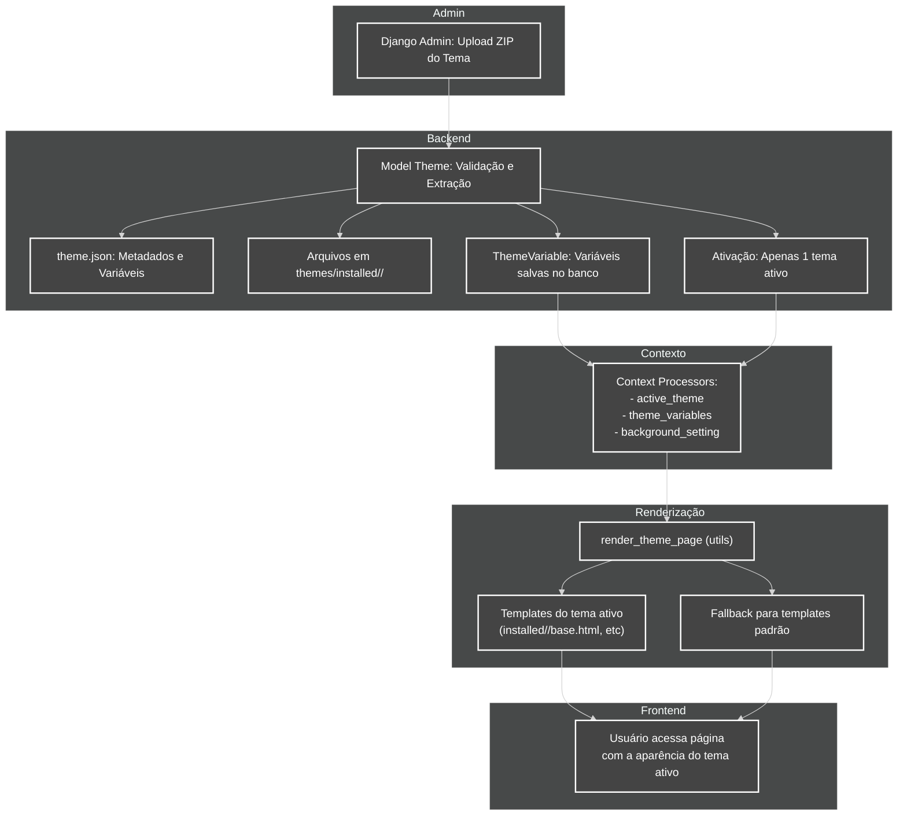

# Diagrama de Fluxo do Sistema de Temas

> **Última atualização:** 21/02/2026

Este diagrama mostra o fluxo completo do sistema de temas, do upload do ZIP até a renderização da página com o tema ativo.

## Legenda
- **Django Admin:** Upload e gerenciamento de temas.
- **Model Theme:** Validação, extração e ativação do tema.
- **theme.json:** Metadados e variáveis do tema.
- **Arquivos extraídos:** Templates, CSS, JS, imagens, etc.
- **ThemeVariable:** Variáveis salvas e internacionalizadas.
- **Context Processors:** Injetam contexto nos templates.
- **render_theme_page:** Função utilitária para renderização dinâmica.
- **Templates do tema ativo:** Templates customizados do tema.
- **Fallback:** Usa templates padrão se não existirem no tema.
- **Usuário:** Visualiza o site com o tema ativo.
---

[ Voltar ao Índice](../INDEX.md)

