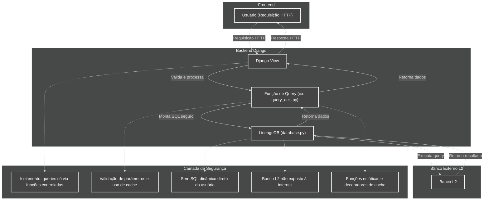

# Diagrama: Segurança ao Usar Django para Acessar o Banco Externo do Lineage 2

> **Última atualização:** 21/02/2026

---

## Fluxo e Explicação de Segurança

### 1. Recepção da Requisição
- O Django recebe uma requisição HTTP (ex.: GET/POST do usuário)
- A requisição é roteada para uma view específica

### 2. Processamento na View
- A view Django é responsável por validar permissões, autenticação e sanitizar os dados recebidos
- Não há passagem direta de SQL ou comandos do usuário para o banco externo

### 3. Chamada da Função de Query
- A view chama funções específicas nos arquivos de query (ex.: `query_acis.py`)
- Essas funções são estáticas, bem definidas e recebem apenas parâmetros controlados

### 4. Montagem e Execução da Query
- O arquivo de query monta o SQL usando parâmetros (nunca concatenação direta de string do usuário)
- A execução é feita via classe `LineageDB` (em `database.py`), que centraliza e controla o acesso ao banco L2

### 5. Execução no Banco Externo
- O banco L2 não está exposto à internet, apenas acessível pelo backend Django
- O acesso é feito por conexão segura e controlada

### 6. Retorno dos Dados
- O resultado da query retorna ao arquivo de query, depois à view e finalmente ao usuário, já processado e validado

---

## Pontos de Segurança

- **Isolamento:** O usuário nunca acessa o banco externo diretamente. Todas as queries passam por funções controladas e revisadas
- **Validação e Cache:** Parâmetros são validados e, quando possível, resultados são cacheados, reduzindo carga e risco de ataques de replay
- **Sem SQL Injection:** Não há montagem dinâmica de SQL com dados do usuário. Sempre são usados parâmetros
- **Banco não exposto:** O banco L2 só pode ser acessado pelo backend, nunca diretamente da internet
- **Funções Estáticas e Decoradores:** O uso de funções estáticas e decoradores de cache dificulta ataques automatizados e de força bruta

---

## Conclusão

Este modelo garante que o acesso ao banco externo do Lineage 2 seja feito de forma segura, controlada e auditável, minimizando riscos comuns de segurança em integrações entre sistemas web e bancos legados ou externos.

---

[ Voltar ao Índice](../INDEX.md)

